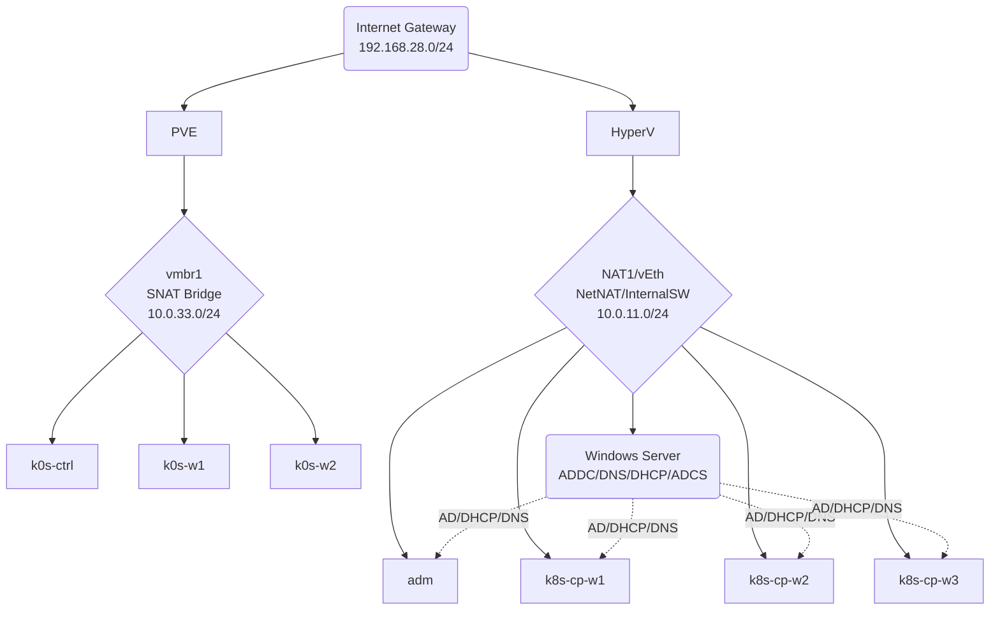

# `pve` : **P**roxmox **V**irtual **E**nvironment 

[Proxmox logo](../autorun.ico)

**Headless install**

**Access**

- **Web**: https://192.168.28.181:8006
- **SSH**: `root@192.168.28.181`

**Creds**
```bash
Ubuntu (master =) ... /s/DEV/devops/infra/hypervisors/proxmox/pve
☩ agede creds.proxmox.age
pve:
  user: root
  pass: Prox***
```

## Infra Architecture and Resources Plan

Here's our preliminiary design goal for this private network: 

* One 3-node K0s cluster (1 control, 2 worker) on Debian 12.
* One RHEL 9 IdM domain controller having cross-forest trust *under* AD (WinSrv 2019) domain controller 
  that is on another subnet (NAT network on 10.0.11.0/24). 
  AD is the authoritative IdP. 

Guest VMs on this pve should be on segregated network (10.0.33.0/24, perhaps) having access to, but protected from, upstream gateway router (192.168.28.1) that connects this network to the internet.



### Storage

The 100GB is default install. Is that too much? Regarding ZFS, taking some 8-16 GB of memory, not sure if we can afford that.

### CPU/RAM

Ryzen 7 has 16 threads. Each is a vCPU under a type-1 hypervisor (pve). 
So, regarding resources (cpu, ram), perhaps  :

* IdM : 2 vCPU / 4 GB 
* K0s control: 2 vCPU / 4 GB
* K0s worker: 4 vCPU / 16 GB

Guest VMs total: 12 CPU / 40 GB

That leaves 4 vCPU / 24 GB for the hypervisor (pve) *and* ZFS

So, if ZFS takes 16 GB, that leaves only 6 GB for pve.


## Assessment

Good plan overall. A few corrections and suggestions:

## CPU Misconception

vCPUs aren't "reserved" — they're scheduled. Proxmox (KVM) time-slices physical cores across VMs. You can safely overcommit for bursty workloads. Your 12 vCPU allocation across 16 threads is conservative and fine.

## RAM Reality

| Component | RAM |
|-----------|-----|
| Proxmox host | ~1-2 GB |
| IdM | 4 GB |
| K0s controller | 4 GB |
| K0s workers (2×16) | 32 GB |
| **Total** | ~42 GB |

Leaves ~22 GB free. You're not using ZFS (you have LVM-thin), so that concern doesn't apply unless you reinstall.

## Assessment by Component

**Storage (100GB root):** Oversized but harmless. Default installer is cautious. Not worth reinstalling.

**IdM (2 vCPU / 4 GB):** Tight but workable for lab. FreeIPA runs LDAP + Kerberos + DNS + CA. If sluggish, bump to 6GB.

**K0s controller (2 vCPU / 4 GB):** Fine for a 3-node cluster.

**K0s workers (4 vCPU / 16 GB each):** Generous — good if you're running real workloads. Could start at 8GB and scale up.

## Network Topology

For the segregated 10.0.33.0/24:

```
                    ┌─────────────────┐
                    │  192.168.28.1   │
                    │  (gateway/NAT)  │
                    └────────┬────────┘
                             │
              ┌──────────────┴──────────────┐
              │ pve host (vmbr0)            │
              │ 192.168.28.x                │
              └──────────────┬──────────────┘
                             │
         ┌───────────────────┴───────────────────┐
         │ vmbr1 (internal only, 10.0.33.0/24)   │
         │ no gateway, or pve as router          │
         └───────────────────┬───────────────────┘
                             │
        ┌────────────┬───────┴────────┬────────────┐
        │            │                │            │
    k0s-ctrl     k0s-w1          k0s-w2         IdM
   10.0.33.11   10.0.33.12      10.0.33.13    10.0.33.10
```

You'll need:

1. Create `vmbr1` (no physical interface, internal only)
2. Either run a router VM, or enable IP forwarding on pve host with iptables NAT

## Revised Resource Allocation

| VM | vCPU | RAM | Disk | Network |
|----|------|-----|------|---------|
| IdM | 2 | 4-6 GB | 40 GB | vmbr1 (+ vmbr0 for AD trust?) |
| k0s-ctrl | 2 | 4 GB | 32 GB | vmbr1 |
| k0s-w1 | 4 | 12 GB | 32 GB | vmbr1 |
| k0s-w2 | 4 | 12 GB | 32 GB | vmbr1 |
| **Total** | 12 | 32-34 GB | 136 GB | |

This leaves ~30GB RAM headroom for growth or burst.

Want to tackle the network setup (vmbr1 + routing) first, 
or proceed with VMs on the flat network for now?

---

## Q:

Let's create a VM on flat network for later teardown, just to have the IaC. 
Then we build the network, and then create VMs on that. 
We want to do all by code rather than web UI.

## A:

Good approach — validate the pattern, then apply to real infra.

### Validate the pattern

Create a VM on flat network: [__`k0s-flat-vm.sh`__](k0s-lab/k0s-flat-vm.sh)

Usage:

```bash
# Create and start
bash k0s-flat-vm.sh create

# Check status
bash k0s-flat-vm.sh status ## No IP due to no qemu-guest-agent
# Add that convenience imperatively ...
ssh k0s@192.168.28.84 '
    sudo apt update &&
        sudo apt install -y qemu-guest-agent &&
            sudo systemctl enable --now qemu-guest-agent
'
#...or bake it into template

# Console access
qm terminal 100 # user: k0s, pass: changeme

# Teardown
bash k0s-flat-vm.sh destroy
```

Prep to bake `qemu-guest-agent` into the template by creating snippet:

```bash
mkdir -p /var/lib/vz/snippets

cat > /var/lib/vz/snippets/k0s-packages.yaml << 'EOF'
#cloud-config
packages:
  - qemu-guest-agent
runcmd:
  - systemctl enable --now qemu-guest-agent
EOF
```
- __`/var/lib/vz`__ is __`local`__ in Proxmox GUI.   
  It's the default local-storage directory  
  used to store __images__ (`*.iso`, `*.qcow2`),   
  container __templates__, and __backups__.   
  It acts as a standard file-based storage pool   
  for VMs and LXCs, often residing on the root partition. 


Create SSH key pair for guest host access:

```bash
ssh-keygen -t ed25519 -f ~/.ssh/id_ed25519 -N ""
```

Add key installation to [__`k0s-flat-vm.sh`__](k0s-lab/k0s-flat-vm.sh).  
Then teardown/recreate the VM:
```bash
bash k0s-lab/k0s-flat-vm.sh destroy
bash k0s-lab/k0s-flat-vm.sh create
```

Revise template: @ [__`debian12-template-v0.0.2.sh`__](k0s-lab/debian12-template-v0.0.2.sh)


Key changes:

| Addition | Purpose |
|----------|---------|
| `pvesm set local --content ...snippets` | Enable snippets on local storage |
| `k0s-base.yaml` | Installs qemu-guest-agent + common tools |
| `--agent enabled=1` | Tells Proxmox to expect the agent |
| `--cicustom vendor=...` | Applies snippet to all clones |

Run it:

```bash
bash debian12-template.sh
```

Teardown / Recreate

```bash
bash k0s-lab/debian12-template-v0.0.2.sh    # Update template 9000
bash k0s-lab/k0s-flat-vm.sh destroy         # Delete old VM 100
bash k0s-lab/k0s-flat-vm.sh create          # Create new VM 100
```
- [__`debian12-template-v0.0.2.sh`__](k0s-lab/debian12-template-v0.0.2.sh)
- [__`k0s-flat.sh`__](k0s-lab/k0s-flat-vm.sh).  


Success!

@ `root@pve [08:30:54] [1] [#0] ~`
```bash
# Create a single test VM
bash vm/k0s-flat.sh

# Shell into `k0s-test` (VM 100) as `k0s`:
ssh k0s@192.168.28.102
```

---

### Build Network and VMs

Pattern is validated. Now we build:

1. [__`net-snat-bridge.sh`__](k0s-lab/net-snat-bridge.sh)
    - Creates `vmbr1`, configures routing/NAT
2. [__`k0s-cluster-vms.sh`__](k0s-lab/k0s-cluster-vms.sh)
    - Creates 3 VMs on `10.0.33.0/24`

```bash
# 1. Create isolated network
bash net-snat-bridge.sh create
bash net-snat-bridge.sh status

# 2. Create cluster
bash k0s-cluster-vms.sh create

# 3. Verify SSH from pve host
ssh k0s@10.0.33.11

# Smoke test SNAT for internet connectivity
ssh k0s@10.0.33.11 "curl -s ifconfig.me && echo"

```

### Install/Create Kubernetes cluster `K0sctl`/`K0s`

Create the 3-node cluster on the VMs of `10.0.33.0/24`

- [__`kubectl-install.sh`__](k0s-lab/kubectl-install.sh)
- [__`k0s-install.sh`__](k0s-lab/k0s-install.sh)

@ `root@pve [12:08:42] [1] [#0] ~/vm`

```bash
bash k0s-install.sh install
export KUBECONFIG=$(pwd)/kubeconfig
```

Change TZ to EST

```bash
timedatectl set-timezone America/New_York
```

## IdM 

Continuing from the original architecture plan, remaining items:

- IdM (FreeIPA)
    - RHEL 9 VM with cross-forest trust to AD
- Network access controls
    - Protecting the `10.0.33.0/24` subnet from upstream

Want to spin up the IdM VM next, 
or take a break and commit these scripts to a repo first?

## Create VM 

### by GUI (button)

1. OS tab — select ISO from `local`
    - But don't do this GUI method. Using a `*.iso` would an interactive install.
    Rather, use __`qm`__-automated __`cloud-init`__ script method on a __`*.qcow2`__ artifact:
        - https://cloud.debian.org/images/cloud/bookworm/latest/ , e.g.,
        - https://cloud.debian.org/images/cloud/bookworm/latest/debian-12-generic-amd64.qcow2
2. Disks tab — select `local-lvm` for the VM's virtual hard drive


### by CLI [`qm`](https://pve.proxmox.com/pve-docs/qm.1.html)

Proxmox CLI for managing QEMU/KVM VMs

| Command | What it does |
|---------|--------------|
| `qm create` | Create a VM |
| `qm set` | Modify VM config |
| `qm start/stop` | Power control |
| `qm importdisk` | Import a disk image |
| `qm template` | Convert VM to template |
| `qm clone` | Clone a VM or template |
| `qm list` | List all VMs |

There's also `pct` for LXC containers, and `pvesm` for storage (which you used earlier).

## Create VM Template 

```bash
bash debian12-template.sh
```

Debian 12 (bookworm) configured for `cloud-init` method (__`*.qcow2`__)

@ [__`debian12-template-v0.0.1.sh`__](pve/vm/debian12-template-v0.0.1.sh)

---

The key question is *why* NAT1 is reachable from LAN. Most likely:

- Hyper-V host has **DNAT/port forwarding** rules forwarding `6443` (kube API) to `k8s-cp-*`
- WinSrv **DNS is authoritative** for those hostnames and LAN clients resolve through it (or it's set as their DNS server)

vmbr1 only has outbound MASQUERADE — there's no inbound path from LAN to `10.0.33.0/24`.

---

## Remote-client (LAN) access to pve/k0s-lab cluster (`vmbr1`)

### Q:

So, we have these two isolated networks, vmbr1 (pve) and NAT1 (hyperv). From a remote host on the LAN (192.168.28.0/24) network, K8s API clients  have access to NAT1 cluster (under ADDC/DHCP/DNS controller), but not vmbr1 cluster, which has no domain controller or anything else. What is the advised way to provision same access to pve cluster as we have on NAT1 cluster?

### A:

The key question is *why* NAT1 is reachable from LAN. Most likely:

- Hyper-V host has **DNAT/port forwarding** rules forwarding `6443` (kube API) to `k8s-cp-*`
- WinSrv **DNS is authoritative** for those hostnames and LAN clients resolve through it (or it's set as their DNS server)

vmbr1 only has outbound MASQUERADE — there's no inbound path from LAN to `10.0.33.0/24`.

---

**Options, in order of simplicity:**

**1. DNAT on PVE host (minimal, quick)**

Add to `vmbr1` config in `/etc/network/interfaces`:
```bash
post-up iptables -t nat -A PREROUTING -i vmbr0 -p tcp --dport 6443 -j DNAT --to 10.0.33.x:6443
post-down iptables -t nat -D PREROUTING -i vmbr0 -p tcp --dport 6443 -j DNAT --to 10.0.33.x:6443
```
Then add a static entry to your LAN DNS (or `/etc/hosts` on client machines) pointing to the PVE host IP. This mirrors what Hyper-V is presumably doing.

**2. MetalLB on k0s + DNAT (cleaner, scalable)**

- Deploy MetalLB with an address pool in a range you reserve, e.g. `10.0.33.200-10.0.33.250`
- DNAT specific LB IPs from PVE's `vmbr0` into `vmbr1`
- Gives you per-service control rather than one-off port forwards

**3. Add a DNS/DHCP VM on vmbr1 (full parity with NAT1)**

Run a small VM (or LXC on PVE) with `dnsmasq` or a CoreDNS instance — equivalent role to your WinSrv. Register it as a DNS server on your LAN gateway. This is full parity with the Hyper-V side but heavier.

---

**Recommended path** given your existing setup:

Option 1 gets you unblocked immediately.  
Option 2 is the right longer-term answer if the k0s cluster grows.  
Option 3 only makes sense if you need DHCP or AD-equivalent services for PVE-hosted workloads — which you currently don't.

What does your LAN DNS situation look like — is WinSrv the authoritative DNS for all of `192.168.28.0/24`, or does your gateway handle that?


### Q:

Yes, WinSrv is *the* DNS. We create that NAT1 to mimic a private-network environment having WinSrv as the domain controller. 


### A:

Since WinSrv owns LAN DNS, the DNS half is already solved — you just add A records for k0s nodes there. The problem is purely **routing inbound from LAN to 10.0.33.0/24**.

You have three real options:

---

**Option A — Static route on the gateway (cleanest)**

Add to your LAN gateway: `10.0.33.0/24 via <PVE-LAN-IP>`

PVE already has `ip_forward=1` and the MASQUERADE rule only applies outbound. Inbound routed traffic from LAN bypasses NAT entirely — `10.0.33.0/24` becomes fully reachable bidirectionally. No DNAT rules, no port-by-port maintenance.

This is also worth asking: *is this how NAT1 LAN access actually works?* If your gateway already has `10.0.11.0/24 via <HyperV-LAN-IP>`, that would explain the connectivity without explicit DNAT on Hyper-V.

---

**Option B — DNAT on PVE host (no gateway access needed)**

If you can't touch the gateway, port-forward specific ports from PVE's LAN IP into `vmbr1`. Workable but you're maintaining a mapping for every service (6443, NodePorts, etc.).

---

**Option C — WireGuard/VPN on PVE (future-proof)**

Run a WireGuard peer on PVE, LAN clients connect to it. Relevant if you're anticipating remote access beyond just the homelab LAN, or once IdM/cross-forest trust is in play and you want the same connectivity model for both clusters without touching gateway routing.

---

**Recommended now:** Option A, and verify whether that's already how NAT1 works. If the gateway already has a static route for `10.0.11.0/24`, adding one for `10.0.33.0/24` is a one-liner and gives you full parity with zero additional complexity before you tackle the IdM migration.


---

### Q: 

We have no access to the LAN's gateway router (to ISP). Access to LAN from NAT1 is due this code:

- `window-server/iac/network`
    - `network-define.ps1`
    - `network-set.ps1`
    - `network-dns.ps1`

### A:

Now the full picture is clear. NAT1 LAN access works because:

- Hyper-V has **IP forwarding enabled** across all vEthernet interfaces
- `vEthernet (ExternalSwitchEth2)` sits on LAN at `192.168.28.47`
- Windows routes between `ExtAlias ↔ NatAlias` — no gateway involvement needed
- LAN clients either have static routes to `192.168.11.0/24 via 192.168.28.47`, or WinSrv DHCP pushes them.

**The PVE equivalent is the same mechanism**, just needing two things:

...

Good pushback — I overclaimed there. Let me be more precise.

WinSrv is on `192.168.11.0/24` (NAT1), not on the LAN directly. So it can only push DHCP options to **NAT1 clients**, not arbitrary LAN hosts. DHCP Option 121 only reaches hosts that are DHCP clients of WinSrv — which the LAN clients are not.

So the question becomes: **how is NAT1 currently reachable from other LAN hosts?** Two possibilities:

1. **It isn't — "LAN access" means only from the Hyper-V host itself**, which has full routing between `ExtAlias ↔ NatAlias`. All the forwarding config in the scripts is for the Hyper-V host's own routing, not for other LAN clients.

2. **Those LAN clients have manually configured static routes** pointing `192.168.11.0/24 via 192.168.28.47`.

If it's (1), then the equivalent for PVE is simply adding a static route **on each client machine** that needs access:

WSL2 (Fail)

```bash
# Linux client
ip route add 10.0.33.0/24 via <PVE-LAN-IP>
```

Powershell (Success)

```bash
# Windows client
[13:00:33] [master ≡] S:\DEV\devops\infra\windows-server\iac\network
PS>  route add 10.0.33.0 mask 255.255.255.0 192.168.28.181 -p
```

@ `Ubuntu (master =) [13:21:41] [1] [#0] /s/DEV/devops/infra/windows-server`

```bash
☩ export KUBECONFIG=~/.kube/config_pve_k0s
☩ k get no
NAME       STATUS   ROLES           AGE   VERSION
k0s-ctrl   Ready    control-plane   27d   v1.34.3+k0s
k0s-w1     Ready    <none>          27d   v1.34.3+k0s
k0s-w2     Ready    <none>          27d   v1.34.3+k0s
```

Symmetric attempt failed, so hyperv clients 
(Win11 Powershell and WSL) 
have access to pve k0s cluster, 
but pve client has no access to hyperv k8s cluster. 

#### Summary : WSL2 Workstation Access to Both Kubernetes Clusters

**k0s cluster (PVE / vmbr1 / `10.0.33.0/24`)**

**Problem:** PVE uses iptables MASQUERADE — all outbound traffic from `10.0.33.0/24` appears as `192.168.28.181`. No inbound path from LAN exists by design.

**Fix:** Static route on the Windows workstation:
```powershell
route add 10.0.33.0 mask 255.255.255.0 192.168.28.181 -p
```

**Why `-p` (persistent) and PowerShell instead of WSL2 `ip route add`:** WSL2 runs in a lightweight VM with its own virtualized network stack. Routes added via `ip route` inside WSL2 are scoped to that VM and don't affect the Windows routing table. The Windows route table is what matters here since packets destined for `10.0.33.0/24` are routed by the Windows host before they ever reach WSL2.

**Why it works:** PVE has `ip_forward=1` and the MASQUERADE rule only fires for traffic *sourced from* `10.0.33.0/24`. Inbound routed traffic from LAN bypasses it entirely. PVE knows both subnets directly so return path works without any additional config.

**k8s cluster (Hyper-V / NAT1 / `192.168.11.0/24`)**

**No additional config needed.** The Hyper-V networking scripts already handled this:
- `Set-NetIPInterface -Forwarding Enabled` on all vEthernet interfaces turns the Hyper-V host into a router between `ExtAlias (192.168.28.x)` and `NatAlias (192.168.11.x)`
- The workstation *is* the Hyper-V host, so it originates traffic directly through that routing path


#### Why the reverse (PVE → NAT1) doesn't work

Windows `NetNat` is a NAT engine, not a general-purpose router. It owns `192.168.11.0/24` as a NAT prefix and only processes outbound sessions it initiated — unsolicited inbound packets from external sources like PVE (`10.0.33.x`) arrive on the external interface and are dropped by NetNAT before any forwarding occurs. Disabling Windows Firewall made no difference because the block is at the NAT layer, not the firewall layer.

---

## **W**ake **o**n **L**an (WoL) 

### How to wake a __headless__ Proxmox node:

- **Configure** for WoL:
    - BIOS/UEFI: 
        - Disable: "`ERP Ready`"
        - Enable: "`Resume By PCI-E Device`"
    - Install `ethtool` (installed by default at pve v8.4.1): 
        ```bash
        apt install ethtool -y
        ```
    - Enable WoL on the public-facing interface (__`$ifc`__): 
        ```bash
        ethtool -s $ifc wol g # Wake on Magic Packet
        ethtool -s $ifc wol u # Wake on any traffic
        ```
    - Make it persistent by appending to the interfaces file &hellip; 
        ```bash
        tee -a /etc/network/interfaces <<-EOH
        post-up /sbin/ethtool -s $ifc wol g
        EOH
        ```
- **Wake Proxmox** (pve):
    - Send Magic Packet:   
        -   Use a WoL app on remote machine to send magic packet to Proxmox's MAC address.
        - SSH config
            ```ini
            Host proxmox pve
                HostName 192.168.1.181
                User root
                # Runs WoL cmd locally before SSH session
                ProxyCommand sh -c "wakeonlan <MAC_ADDR> && sleep 30; nc %h %p"
            ```
- **Wake guest VM** on pve:  
    ```bash
    qm sendkey $vm_id # Wake via SSH ProxyCommand method
    ```
- Automation: Tools like Home Assistant can be configured to detect network activity and automatically send the wake-on-lan packet to boot the server. 

Note: Ensure the NIC supports WOL, as indicated by `Wake-on: g` in the `ethtool` `<interface>` output. 


---

<!-- 

… ⋮ ︙ • ● – — ™ ® © ± ° ¹ ² ³ ¼ ½ ¾ ÷ × ₽ € ¥ £ ¢ ¤ ♻ ⚐ ⚑ ✪ ❤  \ufe0f
☢ ☣ ☠ ¦ ¶ § † ‡ ß µ Ø ƒ Δ ☡ ☈ ☧ ☩ ✚ ☨ ☦ ☓ ♰ ♱ ✖  ☘  웃 𝐀𝐏𝐏 🡸 🡺 ➔
ℹ️ ⚠️ ✅ ⌛ 🚀 🚧 🛠️ 🔧 🔍 🧪 👈 ⚡ ❌ 💡 🔒 📊 📈 🧩 📦 🥇 ✨️ 🔚

# Markdown Cheatsheet

[Markdown Cheatsheet](https://github.com/adam-p/markdown-here/wiki/Markdown-Cheatsheet "Wiki @ GitHub")

# README HyperLink

README ([MD](__PATH__/README.md)|[HTML](__PATH__/README.html)) 

# Bookmark

- Target
<a name="foo"></a>

- Reference
[Foo](#foo)

-->
